<div align="center">

# ⚡ HyperAdmin — Crypto Dashboard

### *Premium Cryptocurrency Portfolio Management & Trading Simulation Interface*

[](https://developer.mozilla.org/en-US/docs/Web/HTML)
[](https://developer.mozilla.org/en-US/docs/Web/CSS)
[](https://developer.mozilla.org/en-US/docs/Web/JavaScript)
[](https://www.chartjs.org/)
[](https://fontawesome.com)
[](LICENSE)

> **HyperAdmin** is a high-fidelity, single-page application prototype designed to simulate a modern cryptocurrency portfolio dashboard. Engineered with a premium **glassmorphic dark UI**, dynamic Chart.js visualizations, real-time simulated price ticks, and full client-side session persistence.

[🔗 View Repository](https://github.com/AnasQ2003/Hyperadmin-Crypto-Dashboard) · [🐛 Report Bug](https://github.com/AnasQ2003/Hyperadmin-Crypto-Dashboard/issues) · [✨ Request Feature](https://github.com/AnasQ2003/Hyperadmin-Crypto-Dashboard/issues)

</div>

---

## ✨ Features

| Category | Feature | Description |
|---|---|---|
| 🔐 **Authentication** | **Client-Side Session Lock** | Glassmorphic login portal with persistent authentication states powered by `localStorage` |
| 📊 **Dashboard** | **Holdings Overview** | Real-time valuation cards for portfolio balance ($USD), 24h change %, and BTC/ETH positions |
| | **Bitcoin Line Chart** | Interactive 30-day historical chart with 1D, 1W, 1M, 1Y, and ALL time scales |
| | **Simulated Live Market** | Live price tickers, dynamic Time & Sales order logs, and overall Market Overview tables |
| | **Trading Terminal** | Mock trading desk widget enabling instant BUY/SELL calculations with fee estimates |
| 💼 **Wallet** | **Balance Ledger** | Portfolio breakdown showing quantities, values, and quick trading shortcuts for major tokens |
| | **Asset Allocation** | Beautiful doughnut chart illustrating percentage distribution of asset holding values |
| | **Funds Transfer Modals** | Simulated deposit address generators (with copy-to-clipboard) and withdrawal forms |
| 🔄 **Transactions** | **History Ledger** | Dynamic record of past orders, deposits, and withdrawals with color-coded status badges |
| 📈 **Portfolio** | **Historical Performance** | Detailed line chart tracking multi-month returns alongside analytical metrics tables |
| 📰 **Market Data** | **Market Capitalization** | Comparative horizontal bar chart for top-tier coins, plus Top Gainers and Top Losers tables |
| ⚙️ **Control Panel** | **Settings & Preferences** | Editable profile info forms, notification checkbox toggles, and functional 2FA switches |

---

## 🖥️ Tech Stack

HyperAdmin is a lightweight, frontend-only application that delivers high-performance mock execution:

| Component | Technology | Purpose |
|---|---|---|
| **Core Layout** | **HTML5** | Semantic layout structure, sidebar menus, and dialog controls |
| **Theme & Design** | **CSS3** | Premium glassmorphism effects (using `backdrop-filter`), CSS Grid/Flex layout systems, custom variables |
| **Interactivity** | **Vanilla JS** | Client-side routing, modular overlay triggers, event handling, real-time database generators |
| **Data Graphs** | **Chart.js** | Premium, high-performance canvas line charts, donut allocations, and vertical bar representations |
| **Session States**| **LocalStorage** | Session caching for active login credentials, UI notification parameters, and 2FA states |

---

## 🚀 Getting Started

### Prerequisites
A modern web browser (Chrome, Firefox, Safari, Edge). No Node.js build pipeline required.

### Quick Start Options

#### Option A: Local File Path
```bash
# Clone the repository
git clone https://github.com/AnasQ2003/Hyperadmin-Crypto-Dashboard.git

# Navigate to project root
cd Hyperadmin-Crypto-Dashboard

# Open in your web browser
# Double-click login.html or run:
start login.html      # Windows
open login.html       # macOS
```

#### Option B: Hot-Reload Server (Recommended)
```bash
# Run a quick local Python server
python -m http.server 8000

# Access your app in the browser
# http://localhost:8000/login.html
```

---

## 📂 Project Structure

```
Hyperadmin-Crypto-Dashboard/
│
├── login.html              # 🔐 Secure login portal with abstract 3D backdrop
├── index.html              # 💻 Main Single Page Application containing all dashboard sections
│                           #    Sections navigated dynamically via client-side JavaScript router:
│                           #      ├─ #dashboard      (Overview stats, price charts, order logs, trade panel)
│                           #      ├─ #wallet         (Asset breakdowns, deposit/withdraw overlays, allocation donut)
│                           #      ├─ #transactions   (Historical ledger lists)
│                           #      ├─ #portfolio      (Multi-month performance graphs)
│                           #      ├─ #market-overview(Bar charts, gainers/losers tables)
│                           #      ├─ #settings       (Profile details editing forms)
│                           #      └─ #notifications  (Recent alarm logs, option toggles)
│
├── e1.png                  # Login screen
├── e2.png                  # Dashboard primary page (dark mode)
├── e3.png                  # Dashboard - Time & Sales + Market Overview lists
├── e4.png                  # Dashboard - Top-right active Notifications dropdown
├── e5.png                  # Wallet - Balance details + Allocation donut chart
├── e6.png                  # Wallet - Deposit funds address generator modal
├── e7.png                  # Wallet - Withdraw funds form modal
├── e8.png                  # Transactions - Historic trade ledger list
├── e9.png                  # Portfolio - Performance indicators & line chart
├── e10.png                 # Settings - Account details + password form
├── e11.png                 # Settings - Alert thresholds + recent notifications
├── e12.png                 # Markets - Market Cap bar chart & gainers lists
├── e13.png                 # Markets - 24h Trading Volume bar chart
├── e14.png                 # Interactive charting - chart tooltip highlight on hover
└── README.md
```

---

## 📸 Screen Preview Gallery

### 🔐 Authenticating & Login

| Login Portal | Dashboard Notifications |
|:-:|:-:|
| 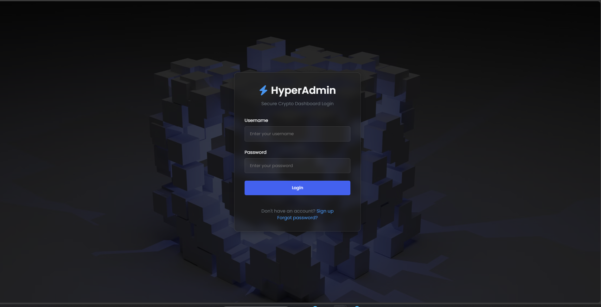 | 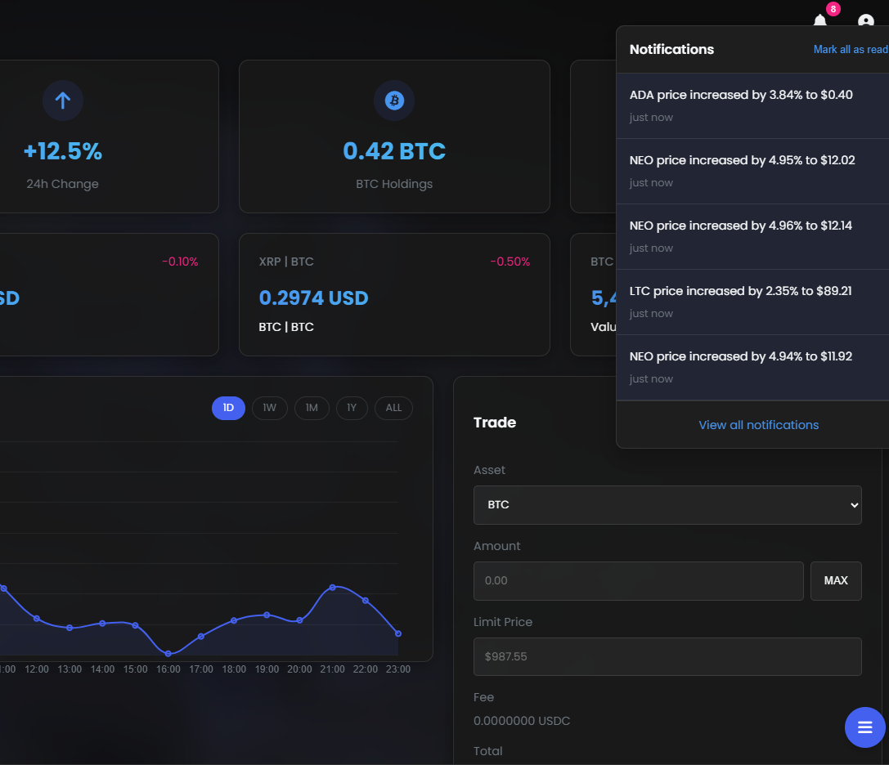 |
| *Glassmorphic credentials container over 3D background* | *Quick-glance price action alerts popup menu* |

---

### 📈 Core Dashboard & Charts

| Primary Overview | Market Data Feeds |
|:-:|:-:|
| 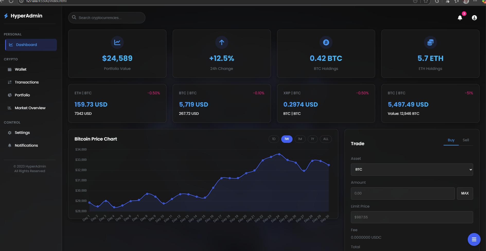 | 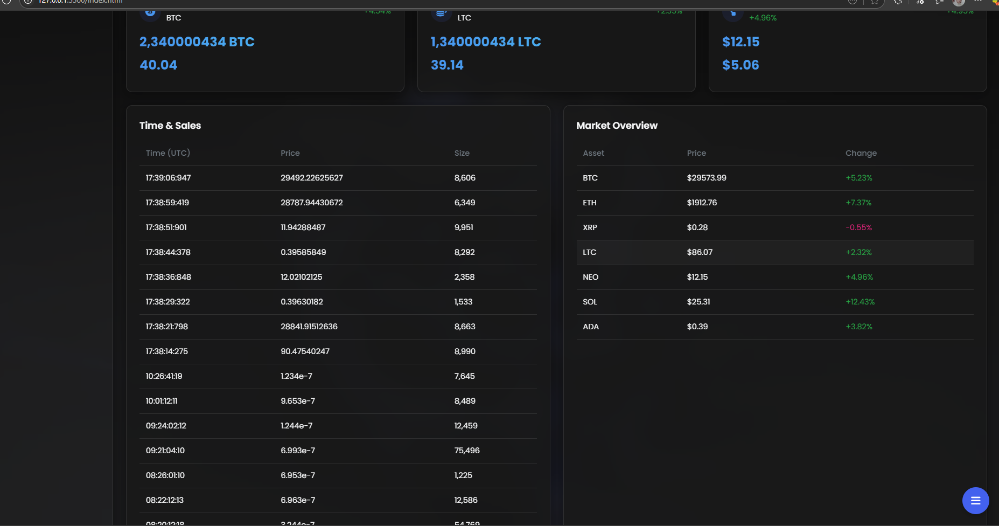 |
| *Interactive 30-day BTC price line chart & trade terminal* | *Real-time Time & Sales order logs and Market Overview* |

---

### 💼 Portfolio & Wallets

| Wallet Balances & Allocation | Historical Performance |
|:-:|:-:|
| 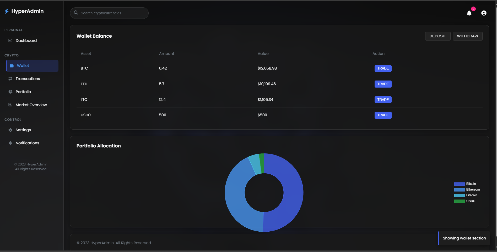 | 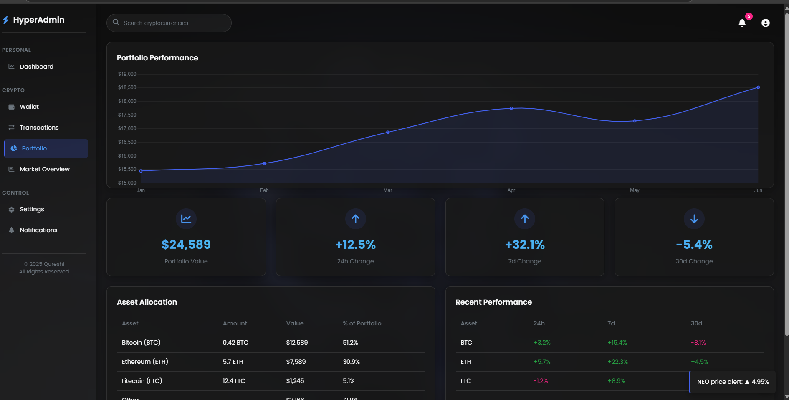 |
| *Balance sheet + Interactive Portfolio Allocation donut* | *Multi-month growth curves and asset yield stats* |

---

### 🔄 Funds Transfers

| Deposit Modal | Withdraw Modal |
|:-:|:-:|
| 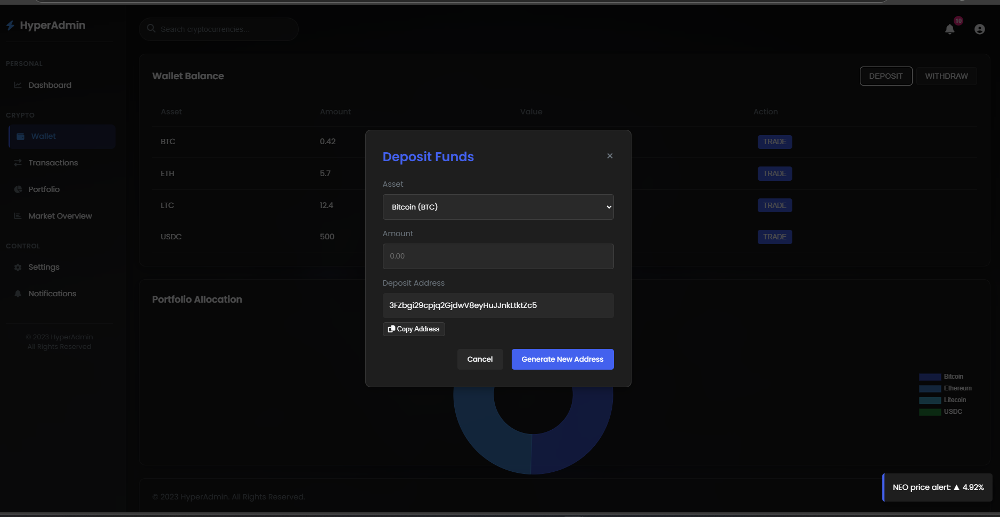 | 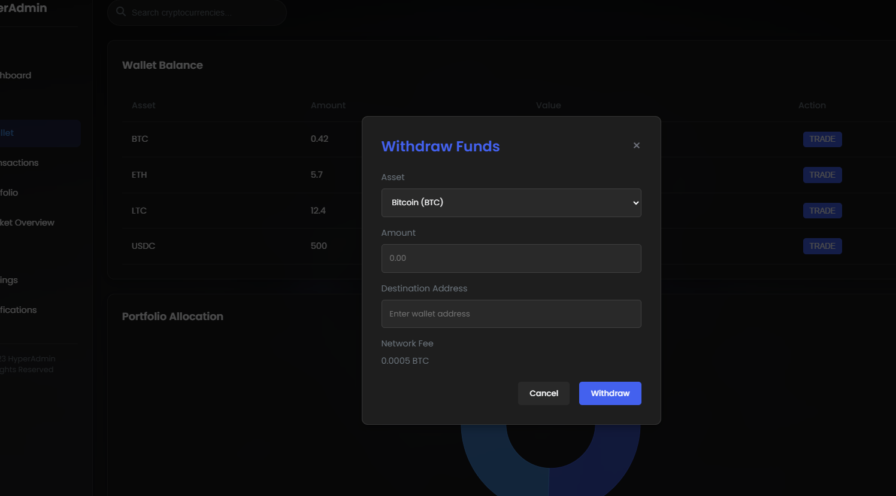 |
| *Generated addresses with single-click clipboard copying* | *Destinations inputs with transaction gas estimates* |

---

### 📑 Transactions & Market Analytics

| Historic Ledger | Market Capitalization |
|:-:|:-:|
| 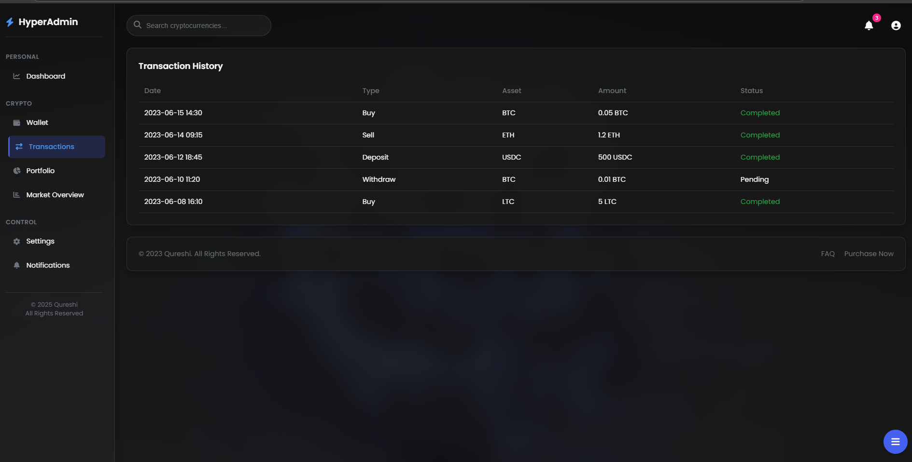 | 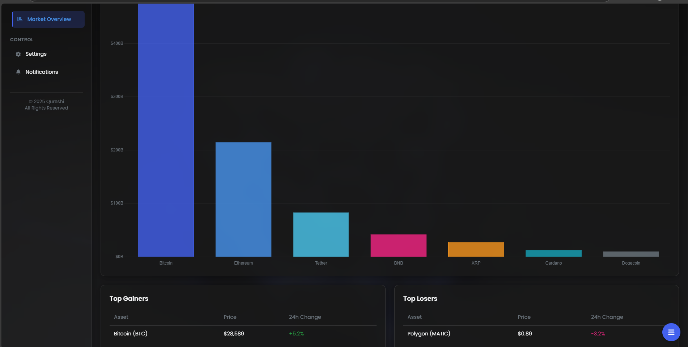 |
| *Trade receipts database with green/yellow badges* | *Top Gainers / Losers + comparative market capitalization graphs* |

---

### 📊 Trading Volumes & Interactive Elements

| 24h Volume Charts | Line Chart Hover Details |
|:-:|:-:|
| 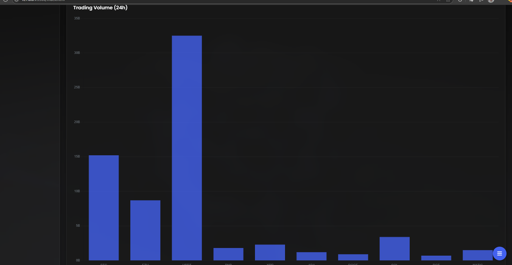 | 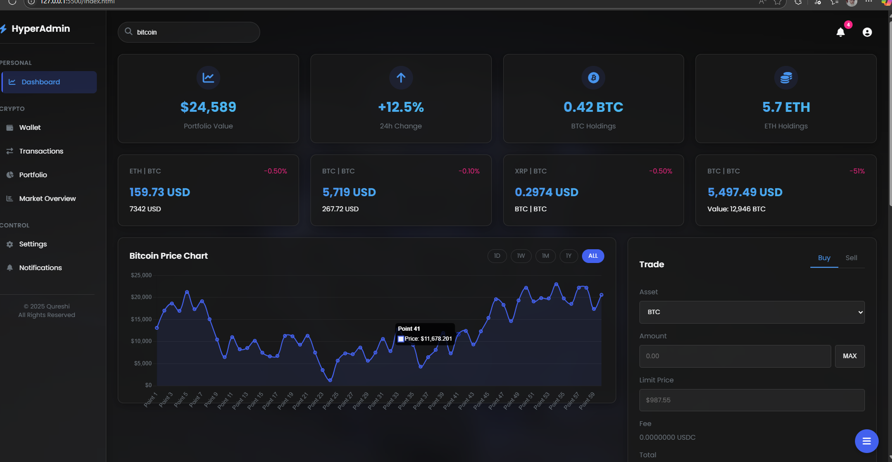 |
| *24-hour comparative trading volume bar chart* | *Interactive point-by-point hover metrics on Chart.js plots* |

---

### ⚙️ Account Management

| Account Settings | Alert Rules & Security |
|:-:|:-:|
| 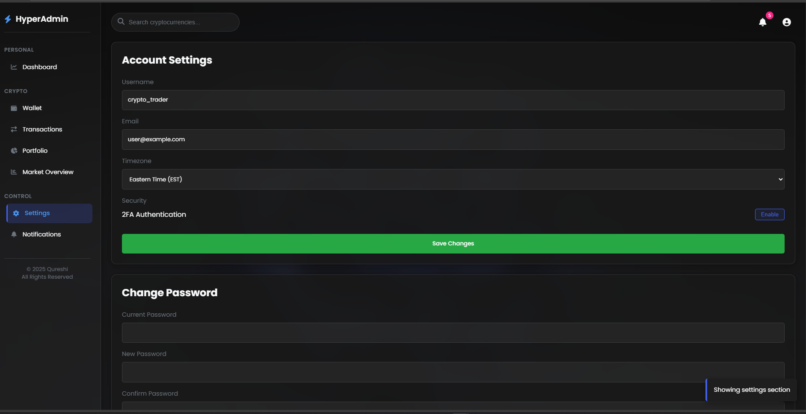 | 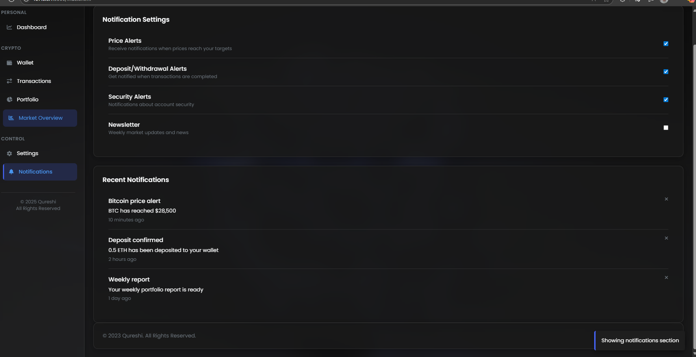 |
| *Username modifications, Email updates, and timezones config* | *Price alert checkboxes and historic notifications logs* |

---

## 🔄 Simulated Logic Architecture

### 📊 Real-Time Market Ticks
HyperAdmin executes a background event loop that updates currency rates every few seconds, generating realistic market data fluctuation:
```javascript
// Simulating dynamic price fluctuations in the browser
function simulatePriceTicks() {
  setInterval(() => {
    assets.forEach(asset => {
      const changePercent = (Math.random() - 0.5) * 0.4; // +/- 0.2% max change
      asset.price *= (1 + changePercent / 100);
      updateDashboardDOM(asset);
    });
  }, 4000);
}
```

### 📈 Canvas Charting Implementation
Donut charts are drawn dynamically using Chart.js configurations:
```javascript
new Chart(ctx, {
  type: 'doughnut',
  data: {
    labels: ['Bitcoin', 'Ethereum', 'Litecoin', 'USDC'],
    datasets: [{
      data: [51.2, 30.9, 5.1, 12.8],
      backgroundColor: ['#2563eb', '#3b82f6', '#60a5fa', '#10b981']
    }]
  },
  options: { responsive: true, cutout: '70%' }
});
```

---

## 🤝 Contributing

1. Fork the project.
2. Create your Feature Branch: `git checkout -b feature/AmazingFeature`
3. Commit your changes: `git commit -m 'feat: add AmazingFeature'`
4. Push to the branch: `git push origin feature/AmazingFeature`
5. Open a Pull Request.

---

## 📄 License

Distributed under the MIT License. See [`LICENSE`](LICENSE) for details.

---

<div align="center">

Made with ⚡ by [AnasQ2003](https://github.com/AnasQ2003)

</div>
